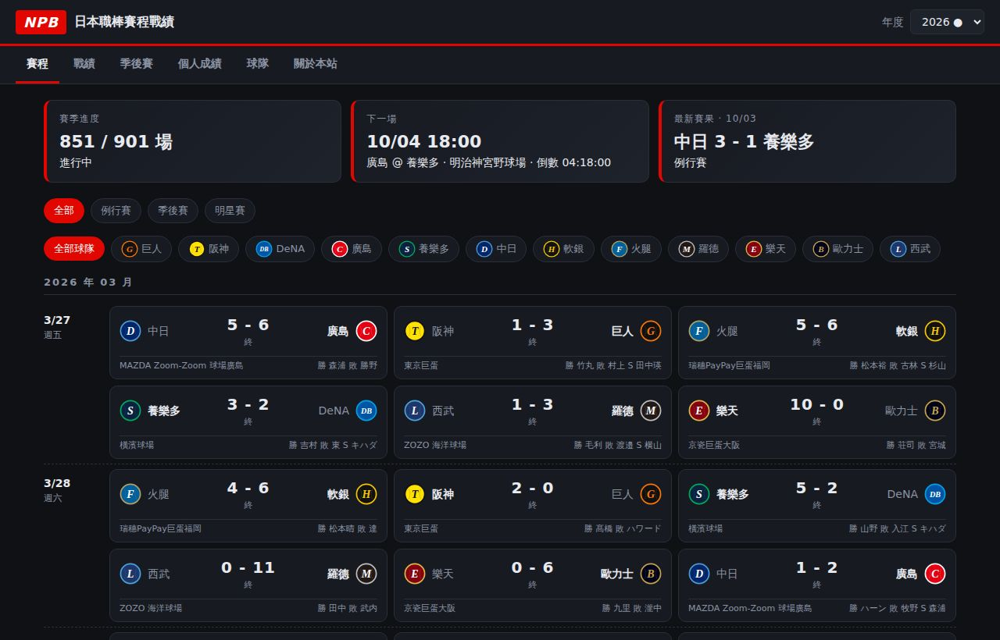
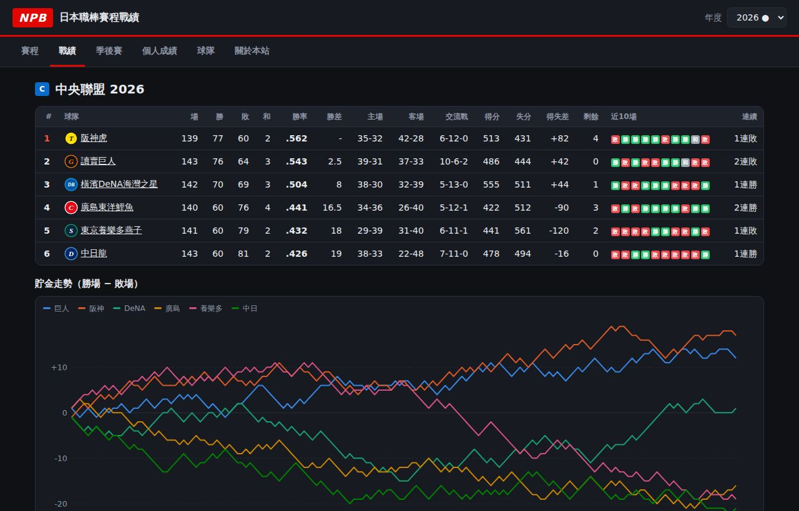
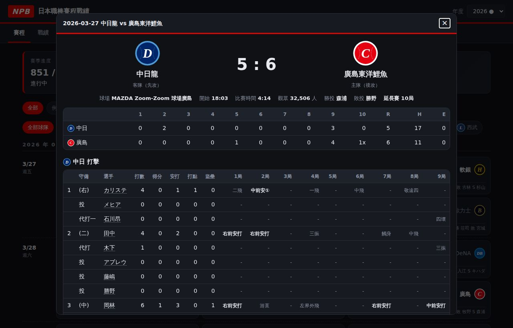
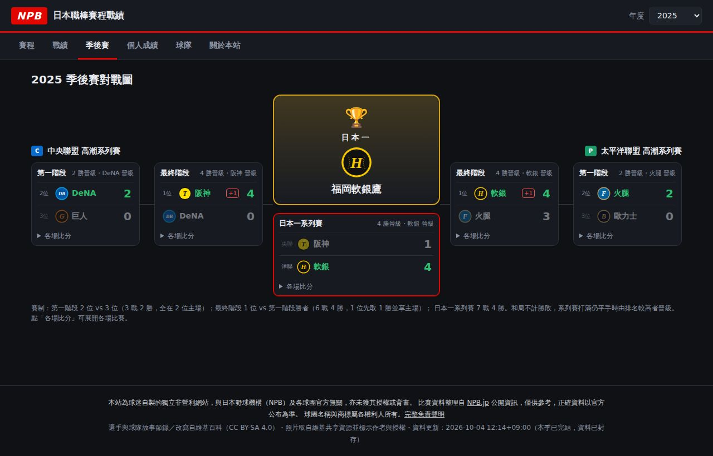
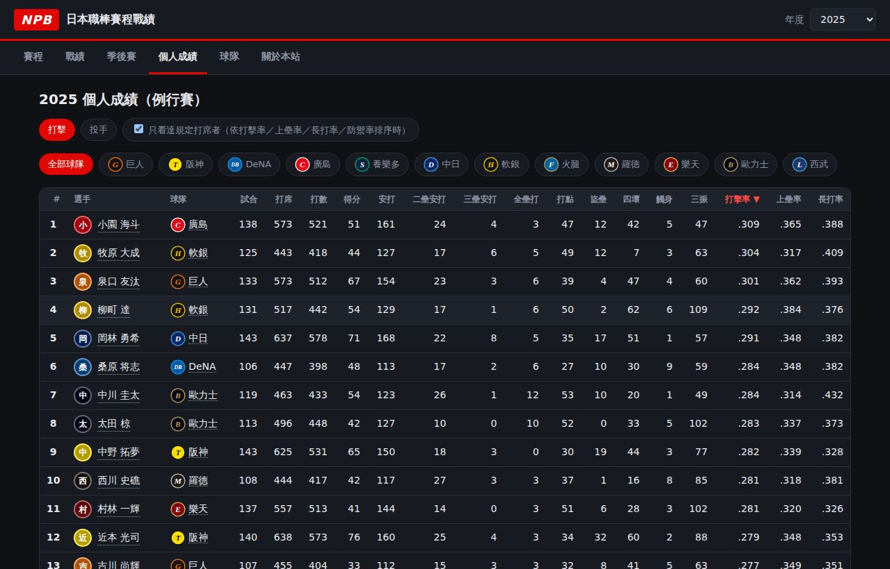
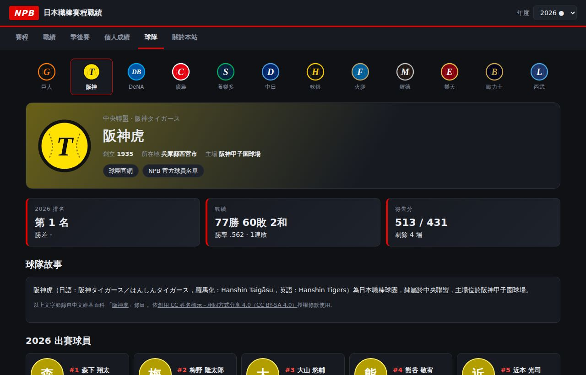
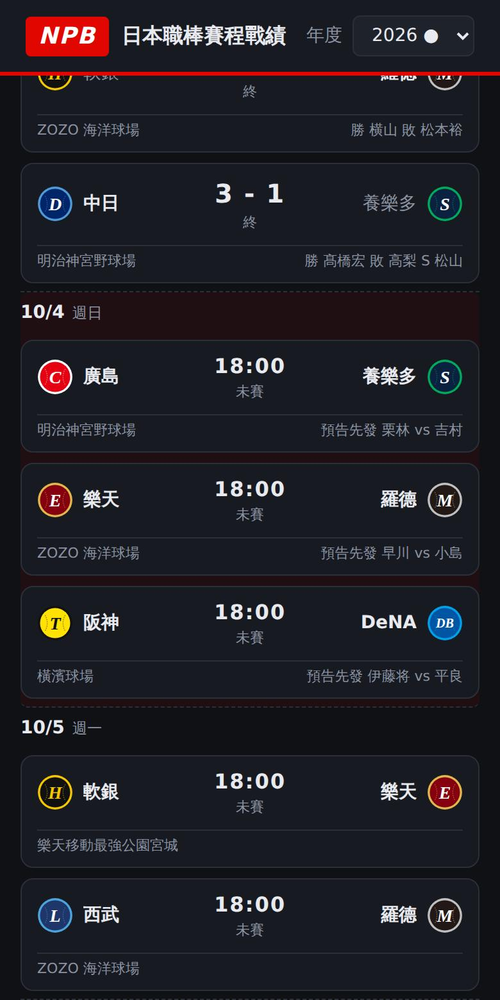

# ⚾ NPB 日本職棒賽程戰績

日本職棒（NPB）各年度的賽程、比分、戰績與單場球員數據網站，介面風格參考 F1 官網的賽季頁。資料每天自動更新，過去年度抓完即封存。

### 👉 [立即瀏覽網站：toothbrushh.github.io/NPB](https://toothbrushh.github.io/NPB/)

> 本站為球迷自製的獨立非營利網站，與日本野球機構（NPB）及各球團官方無關，亦未獲其授權或背書。詳見[著作權與免責聲明](#著作權與免責聲明)。

| 賽程（下一場倒數、預告先發） | 戰績與貯金走勢 |
|:---:|:---:|
| [](https://toothbrushh.github.io/NPB/#/2026/schedule) | [](https://toothbrushh.github.io/NPB/#/2026/standings) |
| **單場數據（逐局比分、每打席結果）** | **季後賽樹狀對戰圖（2025）** |
| [](https://toothbrushh.github.io/NPB/#/2026/schedule) | [](https://toothbrushh.github.io/NPB/#/2025/postseason) |
| **個人成績（NPB 官方年度成績）** | **球隊頁（球隊故事、出賽球員）** |
| [](https://toothbrushh.github.io/NPB/#/2025/players) | [](https://toothbrushh.github.io/NPB/#/2026/teams/T) |

<p align="center"><br><sub>手機版</sub></p>

### 快速連結

| 頁面 | 連結 |
|---|---|
| 2026 賽程 | https://toothbrushh.github.io/NPB/#/2026/schedule |
| 2026 戰績 | https://toothbrushh.github.io/NPB/#/2026/standings |
| 2025 季後賽 | https://toothbrushh.github.io/NPB/#/2025/postseason |
| 2026 個人成績 | https://toothbrushh.github.io/NPB/#/2026/players |
| 球隊（以阪神為例） | https://toothbrushh.github.io/NPB/#/2026/teams/T |
| 關於本站／免責聲明 | https://toothbrushh.github.io/NPB/#/2026/about |

目前收錄年度：2025（已封存）、2026（每日更新）。要補抓其他年度見下方[使用方式](#使用方式)。

## 功能

- **年度切換**：右上角選擇年度，可查詢所有已抓取的球季。
- **賽程**：例行賽、明星賽、高潮系列賽（CS）、日本一系列賽，含已賽與未賽比賽的日期、開賽時間、球場、比分、勝敗投手；顯示「下一場」倒數與最新賽果；可依球隊、賽事類別篩選。
- **單場數據**：點擊比賽卡片可看逐局比分、球場、觀眾數、比賽時間、勝敗救援投手、全壘打，雙方打者名單與當場打擊數據（含每個打席的結果），投手當場數據（含用球數）。
- **未賽比賽**：顯示開賽時間、球場與預告先發投手。
- **戰績**：中央聯盟／太平洋聯盟排名（勝率、勝差、主客場、交流戰、得失分、剩餘場次、近 10 場、連勝敗）與「貯金」走勢圖。
- **季後賽**：樹狀對戰圖，央聯在左、洋聯在右，中間為日本一系列賽與冠軍；顯示各組對戰的勝場數（含聯盟冠軍先取 1 勝）、晉級隊伍，可展開各場比分。季後賽開打前依目前排名顯示預定組合。
- **個人成績**：NPB 官方年度打擊／投手成績（打擊率、上壘率、長打率、防禦率、中繼…），可排序、篩選球隊、只看達規定打席／局數者。
- **球隊頁**：球隊徽章、中文／日文隊名、創立年、所在地、主場、官網連結、維基百科「球隊故事」（節錄／改寫並標示出處）、本季出賽球員、對各隊成績、全季賽程。
- **選手頁**：維基共享資源自由授權照片（標示作者與授權）、全名與假名、背號、守備位置、生日等個人資料、本站撰寫的「選手簡介」、維基百科「選手故事」、年度成績、逐場紀錄（點擊可開啟該場比賽）。比分表、個人成績表中的姓名都可點進選手頁。

## 著作權與免責聲明

- 網頁頁尾常駐免責聲明，並有「關於本站」頁說明：本站為球迷自製的獨立非營利網站，與日本野球機構（NPB）及各球團官方無關。
- **隊徽**：只使用本站自製的隊色徽章 `assets/logos/{代碼}.svg`，不使用官方隊徽（屬各球團商標）。`assets/app.js` 的 `LOGO_SOURCE` 保留切換成官方圖檔的選項，請在取得授權後才開啟。
- **照片**：不使用 NPB／球團的官方照片。只採用維基共享資源上以 CC BY、CC BY-SA、CC0 或公有領域釋出的圖片，照片下方標示「Photo by 作者, 授權」並連回檔案頁。
- **選手簡介**：本站依官方公開的事實資料（生日、投打、經歷、選秀、當季成績）自動組成的原創文字。
- **選手／球隊故事**：`scraper/wiki.py` 在建置時透過維基百科官方 API（Action API，prop=extracts）取得條目導言：
  - 預設節錄前幾句（300 字內）。
  - 若在 GitHub 儲存庫 Settings → Secrets and variables → Actions 新增 `ANTHROPIC_API_KEY`，會改用 Claude 改寫成 200–300 字繁體中文摘要（只用原文中的事實）。
  - 不論節錄或改寫，都屬維基百科內容的衍生，網頁一律標示原條目連結與 CC BY-SA 4.0，改寫內容以相同條款釋出。
  - 只接受與棒球相關的條目（避免同名人物），消歧義頁不採用；查無條目的選手 90 天後才重試。
- 比賽結果與成績數字屬於事實資料，但 npb.jp 網站聲明禁止二次利用其網頁內容；本專案只整理數據、不轉載頁面文字與圖片。公開上線前請自行評估。

## 架構

```
index.html, assets/        靜態網頁（無需建置，GitHub Pages 直接發布）
scraper/npb_scraper.py     爬蟲：從 npb.jp 抓資料並輸出 JSON
data/seasons.json          年度清單
data/{年}/schedule.json    該年度所有比賽
data/{年}/games/{ID}.json  單場詳細數據
data/{年}/players.json     官方年度個人成績
data/{年}/players/{key}.json  選手逐場紀錄
data/{年}/names.json       單場成績表上的簡稱 → 選手
data/players/{ID}.json     選手個人資料（全名、背號、守備位置…）
assets/logos/              自製球隊徽章
scraper/wiki.py            維基百科導言與自由授權照片（含作者、授權資訊）
data/wiki/p/{ID}.json      選手故事與照片出處
data/wiki/t/{代碼}.json    球隊故事與照片出處
.github/workflows/update-data.yml  定時自動更新
```

### 不重複抓取的規則

- 已結束比賽的單場數據寫入 `data/{年}/games/` 後**永不重抓**。
- 過去年度所有比賽都結束且數據齊全後，`schedule.json` 會標記 `"complete": true`，之後**整季跳過**，不再連線 npb.jp。
- 只有當季（`current`）會在每天定時更新。

## 使用方式

1. **開啟 GitHub Pages**：Settings → Pages → Source 選 *Deploy from a branch*，分支選 `main`、資料夾 `/ (root)`。
2. **第一次抓資料**：Actions → *Update NPB data* → *Run workflow*，`seasons` 填入想要的年度，例如：
   - `current`：當季
   - `2024-current`：2024 年至今
   - `2015-2023`：補抓過去年度（每季約 900 場，每場間隔 1 秒，約 20–30 分鐘）
3. 之後排程會自動更新當季資料；過去年度抓完即封存。

### 本機執行

```bash
pip install -r scraper/requirements.txt
python scraper/npb_scraper.py --seasons current          # 當季
python scraper/npb_scraper.py --seasons 2023-2025        # 指定年度
python scraper/npb_scraper.py --seasons 2025 --no-boxes  # 只抓賽程
python -m http.server 8000                               # 開 http://localhost:8000
```

測試：`cd scraper && python -m unittest -v`

## 資料來源

[日本野球機構 NPB.jp](https://npb.jp/)：
- 賽程與比分：`/bis/eng/{年}/calendar/index_{月}.html`
- 單場成績：`/scores/{年}/{月日}/{主}-{客}-{第幾戰}/box.html`（備援：`/bis/{年}/games/s{ID}.html`、英文版）
- 未賽場地、預告先發：`/games/{年}/schedule_{月}_detail.html`
- 年度個人成績：`/bis/{年}/stats/idb1_{隊}.html`、`idp1_{隊}.html`
- 選手個人資料：`/bis/players/{ID}.html`

各頁面請求間隔 1 秒。npb.jp 聲明網站內容禁止二次利用與轉載，本專案僅供個人查詢使用；若要公開散布，請自行確認使用權限。
